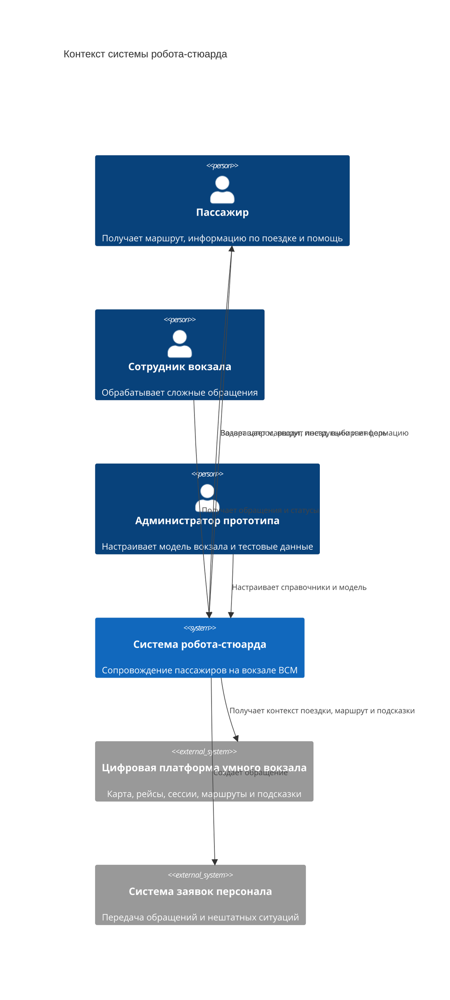

# 02. Контекст и границы

## Контекст системы

Система робота-стюарда находится между пассажиром и цифровой платформой умного вокзала. Она не является источником истины для карты, расписания, билетов или базового маршрута, а использует эти данные для человекоориентированного сопровождения пассажира.

passenger, "Пассажир", Получает маршрут, информацию по поездке и помощь  
staff, "Сотрудник вокзала", Обрабатывает сложные обращения  
admin, "Администратор прототипа", Настраивает модель вокзала и тестовые данные  
   
robot, "Система робота-стюарда", Сопровождение пассажиров на вокзале ВСМ  
platform, "Цифровая платформа умного вокзала", Карта, рейсы, сессии, маршруты и подсказки  
helpdesk, "Система заявок персонала", Передача обращений и нештатных ситуаций  

passenger, robot, Задает запрос, вводит поезд, выбирает цель  
robot, passenger, Возвращает маршрут, инструкцию и информацию  
staff, robot, Получает обращения и статусы  
admin, robot, Настраивает справочники и модель  
robot, platform, Получает контекст поездки, маршрут и подсказки  
robot, helpdesk, Создает обращение  

## Внутри границ MVP

- Прием запроса пассажира.
- Выбор стартовой точки и цели.
- Уточнение недостающего контекста: поезд, цель, ограничения мобильности, язык.
- Получение информации о поездке и маршруте через платформенный адаптер.
- Объяснение маршрута человеку.
- Создание обращения к персоналу.
- Сбор технических и продуктовых событий.
- Администрирование тестовых ответов платформенного mock-адаптера.

## За границами MVP

- Управление физическим перемещением робота.
- Реальное сканирование QR-билета через промышленные API.
- Управление расписанием, платформами и табло.
- Хранение канонической карты вокзала и версий графа.
- Оркестрация общей сессии пассажирского пути для всех каналов вокзала.
- Принятие решений о безопасности вокзала.
- Обработка платежей, покупка билетов и изменение бронирования.
- Автоматическое распознавание опасных предметов и лиц.

## Внешние зависимости

| Зависимость | Роль в целевой системе | Роль в MVP |
| --- | --- | --- |
| Цифровая платформа умного вокзала | Источник карты, рейса, маршрута, подсказок и событий | Mock-адаптер с фиксированными ответами |
| Расписание поездов | Источник актуальных данных отправления через платформу | Тестовые данные внутри mock-адаптера |
| Билетная система | Проверка билета и параметров поездки через платформу | Ввод номера поезда или тестового билета |
| Мониторинг пассажиропотока | Данные о загруженности зон через платформу | Имитируемые коэффициенты загрузки |
| Система заявок персонала | Передача обращений | Локальный журнал обращений |
| Цифровая карта вокзала | Каноническая модель во внешней платформе | Минимальный mock только для демонстрации робота |

## Ключевые ограничения

- Система не должна обещать пассажиру гарантированное прибытие к поезду, если расчет показывает риск опоздания.
- Система должна явно отделять достоверные данные от расчетных оценок.
- Для маломобильных пассажиров робот должен запрашивать безбарьерный маршрут и явно объяснять ограничения.
- При отсутствии данных внешней системы требуется выдавать безопасный fallback: общий маршрут, предупреждение или предложение обратиться к персоналу.
