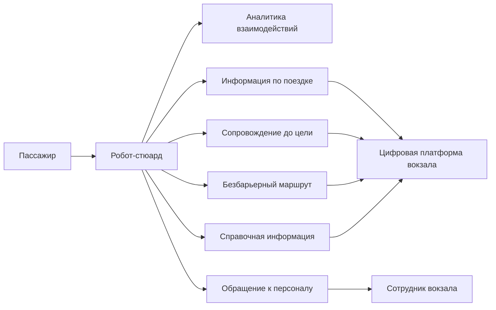

# 03. Требования

## Основные сценарии

Сценарии фиксируют ожидаемое поведение робота-стюарда как пользовательского канала цифровой платформы вокзала. Они используются как источник функциональных требований и приемочных проверок.

| ID | Сценарий | Участник | Краткое описание | Результат |
| --- | --- | --- | --- | --- |
| UC-01 | Получить информацию по поездке | Пассажир | Пассажир вводит номер поезда или тестового билета. Робот запрашивает контекст у цифровой платформы или mock-адаптера. | Пассажир получает время отправления, путь, зону посадки, статус и оставшееся время |
| UC-02 | Построить сопровождение до платформы | Пассажир | Пассажир выбирает стартовую точку и просит провести его к зоне посадки. | Робот показывает маршрут и объясняет его пошагово |
| UC-03 | Успеть на поезд при малом запасе времени | Пассажир | До отправления остается мало времени. Робот запрашивает быстрый маршрут и оценивает риск опоздания. | Пассажир получает короткую инструкцию и предупреждение о риске |
| UC-04 | Получить безбарьерный маршрут | Маломобильный пассажир | Пассажир указывает, что ему нужен маршрут без лестниц и труднодоступных переходов. | Робот запрашивает безбарьерный режим и показывает доступный маршрут либо предлагает помощь |
| UC-05 | Получить сопровождение при изменении платформы | Пассажир | Платформа или зона посадки изменяется после получения маршрута. | Робот объясняет изменение и показывает обновленный маршрут |
| UC-06 | Получить справочную информацию по вокзалу | Пассажир | Пассажир спрашивает о кассах, досмотре, лифтах, выходах, пересадках или сервисных точках. | Робот возвращает краткий ответ и при необходимости маршрут до объекта |
| UC-07 | Создать обращение к персоналу | Пассажир | Пассажиру нужна помощь сотрудника или он сообщает о проблеме. | Робот создает обращение и сообщает пассажиру статус |
| UC-08 | Просмотреть обращения | Сотрудник вокзала | Сотрудник открывает журнал обращений. | Сотрудник видит обращения, зоны, категории и статусы |
| UC-09 | Проанализировать типовые запросы | Администратор прототипа | Администратор смотрит агрегированную статистику взаимодействий. | Система показывает частые запросы, проблемные сценарии и обращения |

## Ошибочные сценарии первой итерации

- Данные поезда не найдены в цифровой платформе или mock-адаптере.
- Цифровая платформа временно недоступна.
- Начальная точка пассажира не определена или отсутствует в ответе платформы.
- Маршрут до цели недоступен.
- Безбарьерный маршрут отсутствует.
- Платформа или зона посадки изменилась во время сопровождения.
- До отправления осталось недостаточно времени.
- Обращение к персоналу не удалось создать.
- Ответ платформы содержит неполные данные.
- Пассажир вводит некорректный номер поезда или билета.

## Функциональные требования

| ID | Требование | Приоритет | Проверка |
| --- | --- | --- | --- |
| FR-01 | Пассажир может выбрать стартовую зону и цель внутри вокзала | Must | UI-тест и сценарный тест |
| FR-02 | Система запрашивает маршрут у цифровой платформы или mock-адаптера | Must | Интеграционный тест адаптера |
| FR-03 | Система поддерживает запрос режимов маршрута: обычный, быстрый, безбарьерный | Must | Набор тестовых сценариев |
| FR-04 | Система объясняет закрытые или недоступные участки на основе ответа платформы | Must | Сценарий с ограничением зоны |
| FR-05 | Пассажир может ввести номер поезда или тестового билета | Must | UI-тест |
| FR-06 | Система показывает время отправления, путь, зону посадки и оставшееся время из платформенного контекста | Must | Интеграционный тест с mock-платформой |
| FR-07 | Система предупреждает о риске опоздания | Should | Сценарий с малым временем до отправления |
| FR-08 | Пассажир может создать обращение к персоналу | Should | Тест создания обращения |
| FR-09 | Сотрудник видит журнал обращений | Should | Проверка административного интерфейса |
| FR-10 | Система собирает статистику типовых запросов и диалоговых исходов | Should | Проверка событий и отчета |
| FR-11 | Система поддерживает мультиязычность как точку расширения | Could | Проверка структуры словаря ответов |

## Нефункциональные требования

| ID | Требование | Целевое значение MVP |
| --- | --- | --- |
| NFR-01 | Время ответа робота на запрос сопровождения | До 1 секунды без учета внешней платформы |
| NFR-02 | Доступность прототипа | Локальный запуск без внешних сервисов |
| NFR-03 | Объяснимость маршрута | Каждый маршрут сопровождается текстовыми шагами |
| NFR-04 | Безопасность | Нет хранения платежных данных и реальных документов |
| NFR-05 | Расширяемость | Цифровая платформа подключается через адаптер с явным контрактом |
| NFR-06 | Тестируемость | Диалоговые сценарии и адаптер платформы покрыты тестами |
| NFR-07 | Наблюдаемость | Запросы, ошибки и обращения логируются |

## Продуктовые правила

| Правило | Описание |
| --- | --- |
| PR-01 | Если до отправления мало времени, система должна показать предупреждение о риске опоздания |
| PR-02 | Безбарьерный режим должен запрашивать у платформы маршрут без лестниц и недоступных переходов |
| PR-03 | Если путь отправления изменился, робот должен получить обновленный маршрут и объяснить изменение пассажиру |
| PR-04 | Если данных о поездке нет, система не должна придумывать информацию |
| PR-05 | Сервисное обращение должно содержать зону, тип проблемы и время создания |
| PR-06 | Пользовательский ответ должен быть коротким и пригодным для чтения на экране терминала |

## Ограничения данных

- В MVP используются синтетические ответы цифровой платформы вокзала.
- Персональные данные пассажира не хранятся.
- Номер билета в прототипе считается тестовым идентификатором.
- История обращений используется для аналитики только в обезличенном виде.
