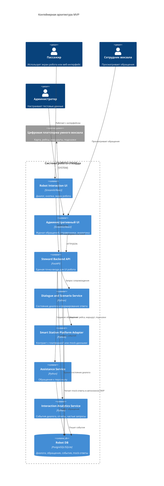
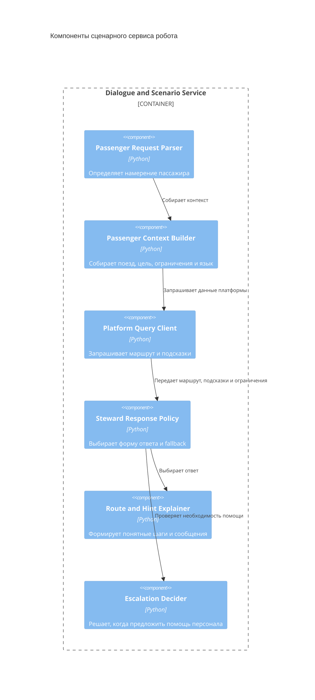

# 05. Архитектура

## Общий подход

Система строится как специализированный пользовательский канал поверх цифровой платформы умного вокзала. Главная логика сосредоточена не в хранении карты и не в оркестрации всего пассажирского пути, а в диалоге, уточнении контекста, адаптации платформенных подсказок и сервисной эскалации.

## Контейнеры

## Компоненты Dialogue and Scenario Service

## Основные политики

| Политика | Описание |
| --- | --- |
| Политика маршрутизации | Робот запрашивает у платформы маршрут с нужным режимом и объясняет результат |
| Политика достоверности | При отсутствии данных поездки система показывает предупреждение и не выдает выдуманную информацию |
| Политика доступности | Робот не показывает маршрут как пригодный, если платформа вернула ограничение доступности |
| Политика интеграций | Цифровая платформа и система заявок подключаются через адаптеры |
| Политика аналитики | События собираются без персональных данных |

## Ключевые интерфейсы

- `POST /steward/dialogue` - обработать реплику или действие пассажира.
- `POST /steward/route-explanation` - получить человекочитаемое объяснение маршрута.
- `GET /steward/trip/{train_number}` - получить адаптированную для пассажира информацию по поездке.
- `POST /assistance/request` - создать обращение.
- `GET /analytics/summary` - получить агрегированную статистику.
- `GET /platform-adapter/health` - проверить доступность платформы или mock-адаптера.

## Технологический стек MVP

- Python - доменная логика.
- FastAPI - backend API.
- Локальные JSON/SQLite mock-данные - автономная имитация платформы для демонстрации.
- PostgreSQL - целевое хранилище диалогов, обращений и событий; SQLite допустим для локальной демонстрации.
- Streamlit или простой web UI - быстрый демонстрационный интерфейс.
