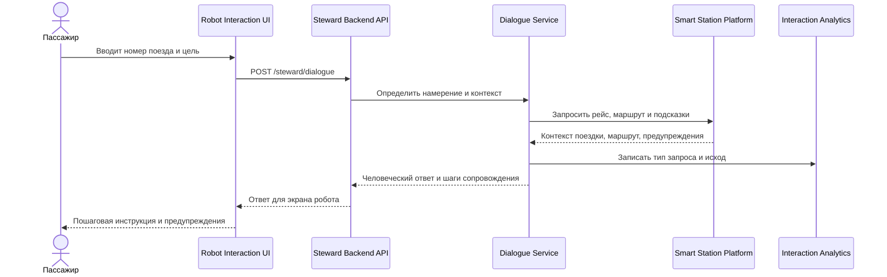
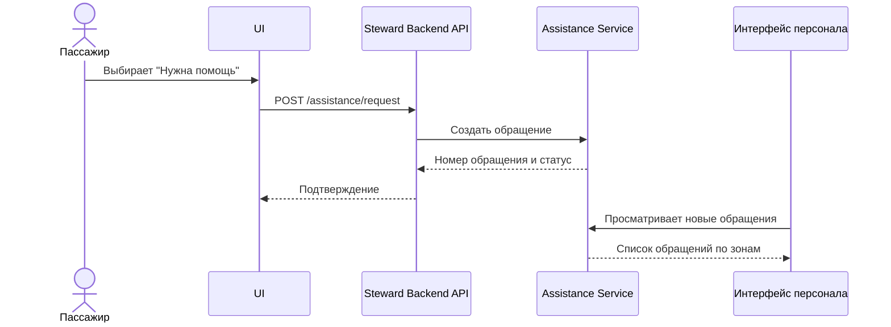
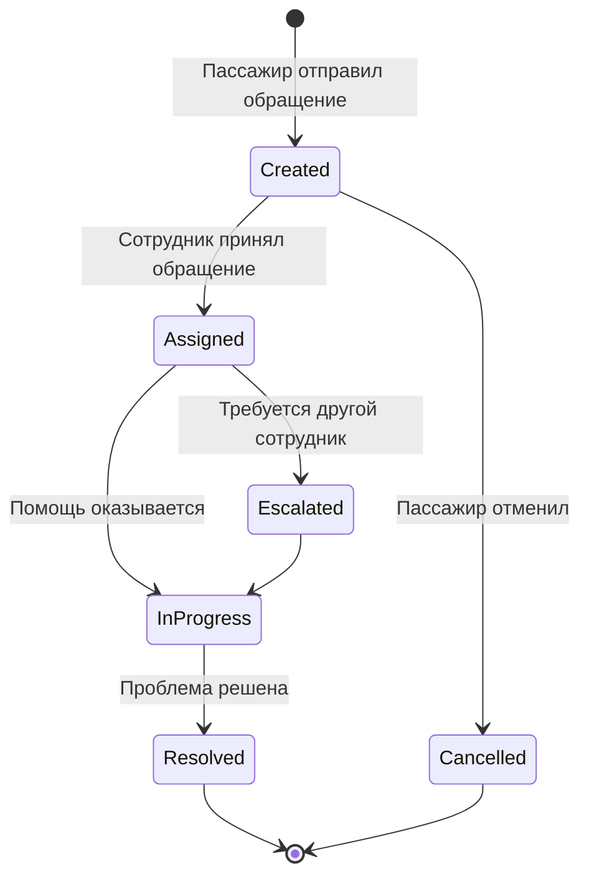

# 06. Сценарии и потоки

## Основные сценарии

| Сценарий | Цель пассажира | Результат |
| --- | --- | --- |
| Найти платформу | Добраться до зоны посадки | Маршрут и инструкция |
| Проверить поездку | Узнать путь, время и статус отправления | Карточка поездки |
| Успеть на поезд | Получить самый быстрый маршрут | Быстрый маршрут и предупреждение о риске |
| Найти безбарьерный путь | Избежать лестниц и недоступных зон | Безбарьерный маршрут |
| Сообщить о проблеме | Передать обращение персоналу | Заявка в журнале |
| Найти выход после прибытия | Добраться до метро, такси или парковки | Маршрут до выхода |

## Поток сопровождения пассажира

## Поток обращения к персоналу

## Жизненный цикл обращения

## Негативные сценарии

- Данные поезда не найдены: робот предлагает выбрать цель вручную и обратиться к табло или сотруднику.
- Маршрут недоступен: робот объясняет причину из ответа платформы и предлагает вызвать сотрудника.
- Зона закрыта после построения маршрута: робот запрашивает обновленный маршрут и объясняет изменение.
- Времени до отправления недостаточно: система показывает предупреждение о риске опоздания.
- Обращение не удалось создать: система показывает сообщение об ошибке и предлагает обратиться к стойке информации.
