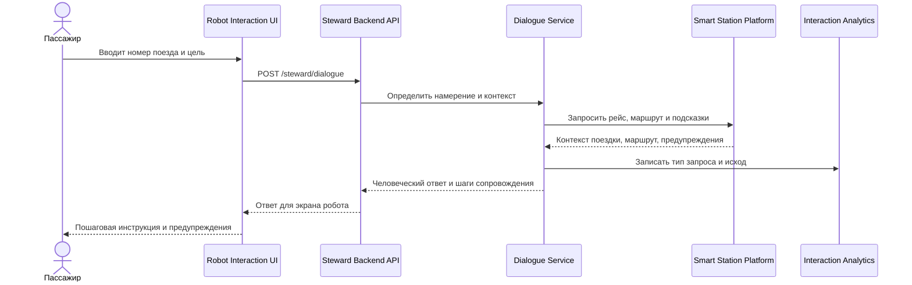
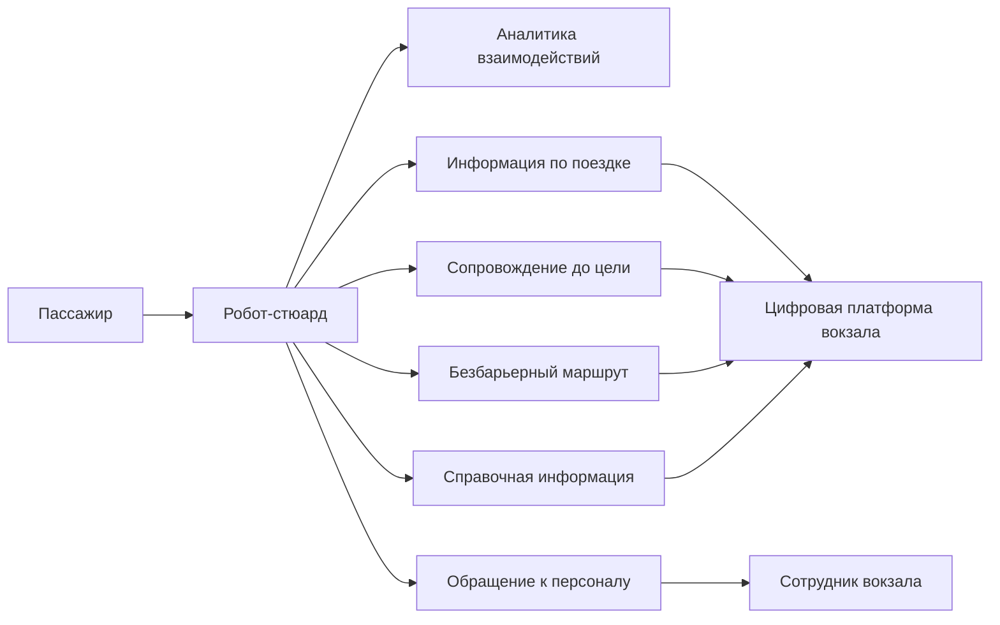
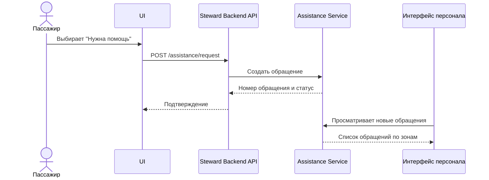
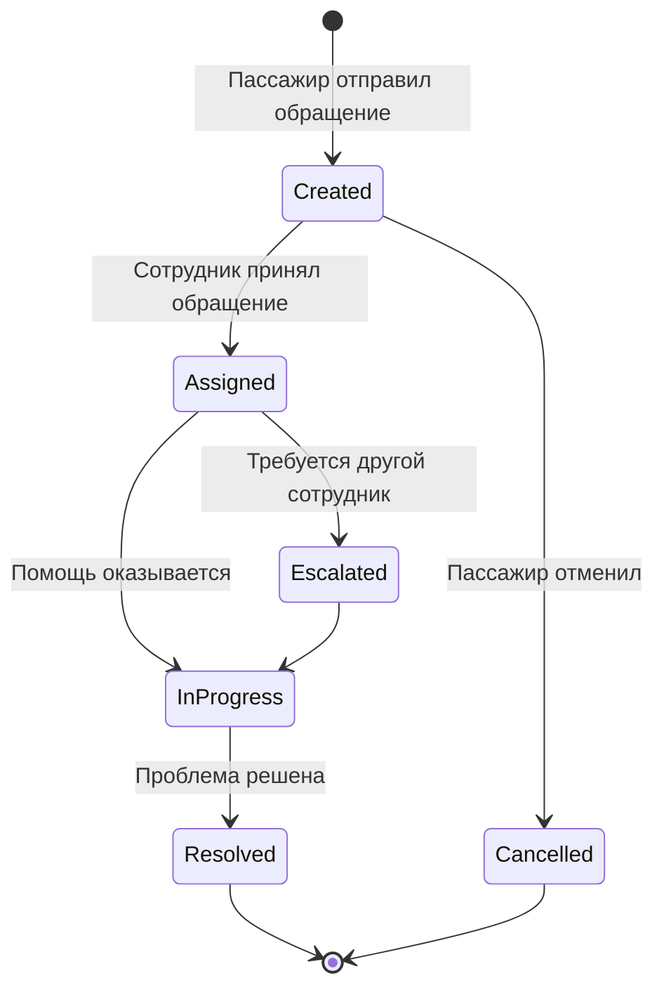

# 06. Сценарии и потоки

## Основные сценарии

| Сценарий | Цель пассажира | Результат |
| --- | --- | --- |
| Найти платформу | Добраться до зоны посадки | Маршрут и инструкция |
| Проверить поездку | Узнать путь, время и статус отправления | Карточка поездки |
| Успеть на поезд | Получить самый быстрый маршрут | Быстрый маршрут и предупреждение о риске |
| Найти безбарьерный путь | Избежать лестниц и недоступных зон | Безбарьерный маршрут |
| Сообщить о проблеме | Передать обращение персоналу | Заявка в журнале |
| Найти выход после прибытия | Добраться до метро, такси или парковки | Маршрут до выхода |

## Поток сопровождения пассажира

| ID | Сценарий | Участник | Краткое описание | Результат |
| --- | --- | --- | --- | --- |
| UC-01 | Получить информацию по поездке | Пассажир | Пассажир вводит номер поезда или тестового билета. Робот запрашивает контекст у цифровой платформы или mock-адаптера. | Пассажир получает время отправления, путь, зону посадки, статус и оставшееся время |
| UC-02 | Построить сопровождение до платформы | Пассажир | Пассажир выбирает стартовую точку и просит провести его к зоне посадки. | Робот показывает маршрут и объясняет его пошагово |
| UC-03 | Успеть на поезд при малом запасе времени | Пассажир | До отправления остается мало времени. Робот запрашивает быстрый маршрут и оценивает риск опоздания. | Пассажир получает короткую инструкцию и предупреждение о риске |
| UC-04 | Получить безбарьерный маршрут | Маломобильный пассажир | Пассажир указывает, что ему нужен маршрут без лестниц и труднодоступных переходов. | Робот запрашивает безбарьерный режим и показывает доступный маршрут либо предлагает помощь |
| UC-05 | Получить сопровождение при изменении платформы | Пассажир | Платформа или зона посадки изменяется после получения маршрута. | Робот объясняет изменение и показывает обновленный маршрут |
| UC-06 | Получить справочную информацию по вокзалу | Пассажир | Пассажир спрашивает о кассах, досмотре, лифтах, выходах, пересадках или сервисных точках. | Робот возвращает краткий ответ и при необходимости маршрут до объекта |
| UC-07 | Создать обращение к персоналу | Пассажир | Пассажиру нужна помощь сотрудника или он сообщает о проблеме. | Робот создает обращение и сообщает пассажиру статус |
| UC-08 | Просмотреть обращения | Сотрудник вокзала | Сотрудник открывает журнал обращений. | Сотрудник видит обращения, зоны, категории и статусы |
| UC-09 | Проанализировать типовые запросы | Администратор прототипа | Администратор смотрит агрегированную статистику взаимодействий. | Система показывает частые запросы, проблемные сценарии и обращения |

## Поток обращения к персоналу

## Жизненный цикл обращения

## Негативные сценарии

- Данные поезда не найдены: робот предлагает выбрать цель вручную и обратиться к табло или сотруднику.
- Маршрут недоступен: робот объясняет причину из ответа платформы и предлагает вызвать сотрудника.
- Зона закрыта после построения маршрута: робот запрашивает обновленный маршрут и объясняет изменение.
- Времени до отправления недостаточно: система показывает предупреждение о риске опоздания.
- Обращение не удалось создать: система показывает сообщение об ошибке и предлагает обратиться к стойке информации.
