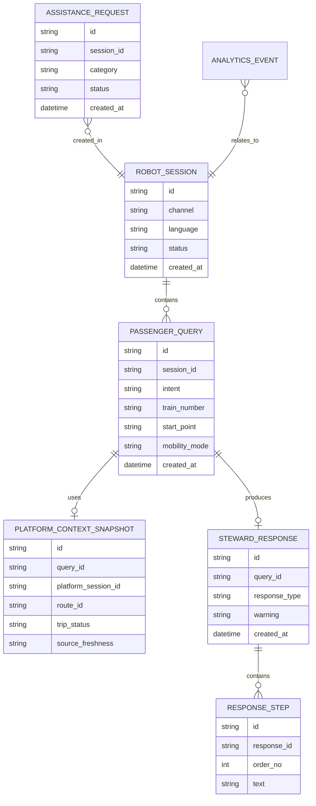

# 07. Данные и хранилища

## Основные сущности робота-стюарда

## Хранилища

| Хранилище | Данные | MVP |
| --- | --- | --- |
| Robot DB | Диалоги, запросы, обращения, события, снимки ответов платформы | PostgreSQL или SQLite |
| Mock Platform Data | Тестовые ответы платформы: рейсы, маршруты, ограничения | JSON/SQLite для автономного MVP |
| Логи приложения | Ошибки, технические события | Файл или stdout |

## Правила хранения

| Данные | Срок хранения MVP | Комментарий |
| --- | --- | --- |
| Сессии робота | До завершения эксперимента | Не являются глобальной `JourneySession` платформы |
| Снимки платформенного контекста | Ограниченно | Нужны для объяснимости ответа |
| Mock-данные платформы | Постоянно в MVP | Не являются канонической картой вокзала |
| Пользовательские запросы | Ограниченно | Без персональных данных |
| Ответы робота | Ограниченно | Нужны для анализа качества сопровождения |
| Обращения | До завершения пилотного сценария | Для демонстрации обработки заявок персоналом |
| Аналитические события | До завершения эксперимента | Только агрегированная аналитика |

## Данные платформы

Канонические данные вокзала не принадлежат системе робота. В целевой архитектуре робот получает от цифровой платформы:

- контекст рейса;
- актуальную платформу или зону посадки;
- маршрут или набор шагов маршрута;
- предупреждения: смена платформы, закрытие зоны, риск опоздания;
- признаки доступности маршрута;
- публичные подсказки и сообщения.

В автономном MVP эти ответы задаются локально, чтобы показать поведение робота без подключения к внешней платформе.

## Качество данных

- У каждого mock-ответа платформы должен быть идентификатор сценария.
- Для маршрута к поезду должна быть известна зона посадки или причина отсутствия данных.
- Ответ робота должен ссылаться на свежесть платформенного контекста.
- Если данные неполные, робот должен объяснить ограничение и предложить безопасный следующий шаг.
