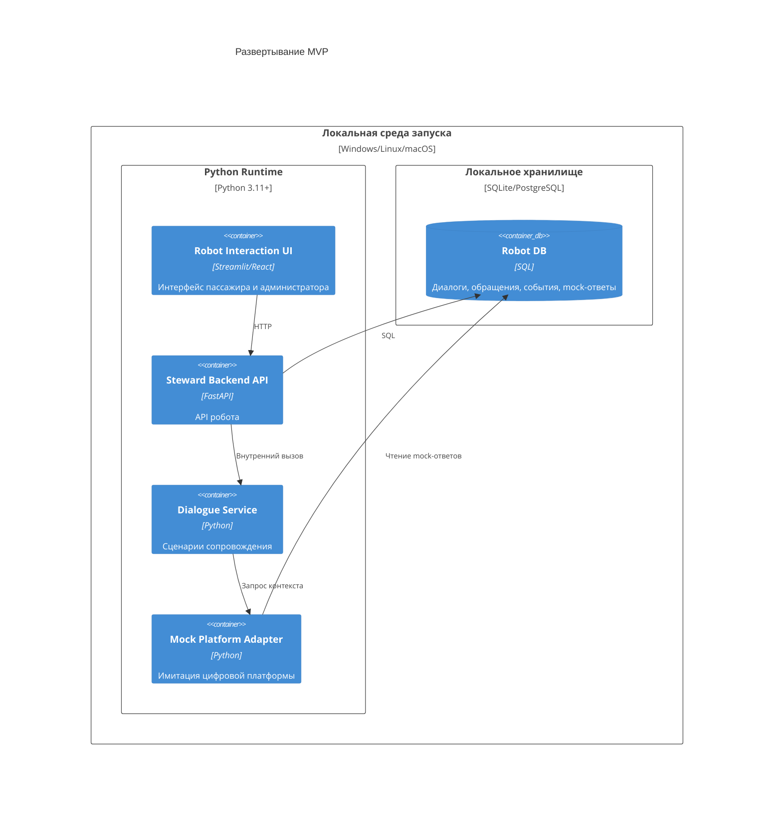

# 08. Развертывание

## Развертывание MVP

MVP должен поддерживать локальный запуск в изолированной среде. Это снижает зависимость от внешней инфраструктуры и позволяет проверить сценарии сопровождения на демонстрационных данных.

## Целевая схема после MVP

В промышленном варианте систему можно развернуть как набор сервисов внутри вокзальной инфраструктуры:

- frontend на терминале робота;
- backend API робота;
- сценарный сервис робота;
- адаптер цифровой платформы умного вокзала;
- адаптер заявок персонала;
- база данных;
- мониторинг и журналирование.

## Конфигурация MVP

| Параметр | Значение |
| --- | --- |
| Режим запуска | Локальный |
| Внешние API | Отключены, используется mock цифровой платформы |
| База данных | SQLite для раннего прототипа, PostgreSQL для целевого описания |
| Данные вокзала | Приходят из mock-адаптера как ответы платформы |
| Наблюдаемость | Логи и простая статистика |

## Ограничения эксплуатации

- MVP не рассчитан на большое число одновременных пользователей.
- Нет требований к круглосуточной доступности.
- Нет промышленной схемы резервирования.
- Данные цифровой платформы имитируются.

## Путь к промышленному развертыванию

1. Согласовать контракт API с цифровой платформой умного вокзала.
2. Заменить mock-адаптер реальным платформенным адаптером.
3. Добавить авторизацию сотрудников.
4. Разделить пользовательский интерфейс робота и административную панель.
5. Включить централизованное логирование и мониторинг.
6. Проверить систему на отказах платформы и канала заявок.
